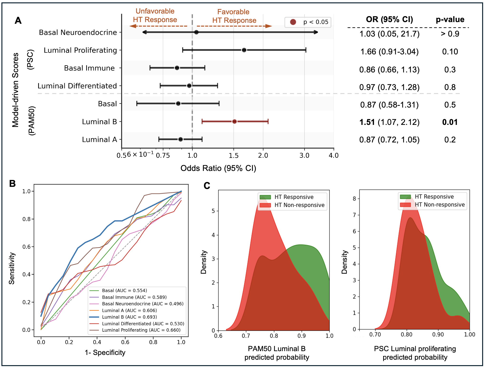

# PCaSub-MB-sMIL: Multi-Instance Learning for Predicting PAM50 and PSC Molecular Subtypes of Prostate Cancer [npj Precision Oncology 2025]

A distributed training framework for predicting molecular subtypes of prostate cancer using pathology whole slide images based on 
Multi-branch self-attention-based MIL (MB-sMIL) model and fine-tuning pathology foundational model UNIv2.

---

### Training Pipeline

Our framework employs a two-stage fine-tuning strategy: (1) training the MB-sMIL aggregator with a frozen UNIv2 encoder on all tiles, then (2) fine-tuning UNIv2 on the most informative tiles selected by attention weights. At inference, patient-level molecular subtype scores are aggregated across biopsy blocks for downstream clinical outcome prediction.


---

### Histological Patterns Associated with PAM50 and PSC Molecular Subtypes 

Using UMAP projections and K-means clustering (k=8) on high-attention tiles, we identify distinct morphological patterns linked to PAM50 and PSC subtypes. Basal-type tumors cluster with aggressive features (GP4/5, poorly formed glands), while luminal A and luminal differentiated subtypes show well-formed glands with low nuclear-to-cytoplasmic ratios.


---

### Association with Hormone Therapy Response

In an independent cohort of 131 patients, model-predicted PAM50 Luminal B scores showed the strongest association with favorable hormone therapy (HT) response (OR = 1.51, p = 0.01, AUC = 0.693), with PSC Luminal Proliferating scores also trending positive. These findings suggest the model captures biologically meaningful androgen receptor–driven features directly from H&E slides.



---

## Requirements

- Python 3.8+
- PyTorch 2.0+
- CUDA-capable GPUs
- See `requirements.txt` for full dependencies

## Installation

```bash
# Clone the repository
git clone https://github.com/yourusername/pcasub-mb-mil.git
cd pcasub-mb-mil

# Install dependencies
pip install -r requirements.txt
```

## Configuration

Edit `config/config.yaml` to set:
- **Hugging Face Token**: Get from https://huggingface.co/settings/tokens
- **Data Directory**: Path to your slide patches
- **Model Parameters**: Adjust as needed
- **Training Hyperparameters**: Learning rate, epochs, etc.

## Usage

### Training

```bash
# Single GPU
torchrun --nproc_per_node=1 train.py

# Multi-GPU (e.g., 4 GPUs)
torchrun --nproc_per_node=4 train.py

# With custom config
torchrun --nproc_per_node=4 train.py --config path/to/config.yaml
```

### Testing

```bash
# Test with best checkpoint on test set
torchrun --nproc_per_node=4 test.py --checkpoint ./checkpoints/checkpoint.pth

# Test on validation set
torchrun --nproc_per_node=4 test.py --checkpoint ./checkpoints/checkpoint.pth --split val

# Test on training set
torchrun --nproc_per_node=1 test.py --checkpoint ./checkpoints/checkpoint.pth --split train
```

## Model Architecture

- **Foundation Model**: UNI-2 (Vision Transformer)
    - **Feature Dimension**: 1536
- **MIL Aggregator**: Multi-branch self-attention-based MIL (MB-sMIL)
    - **Classification**: multi-class prostate cancer subtyping

## Output

Training produces:
- `checkpoints/checkpoint.pth` - Best model based on validation F1
- `checkpoints/last_checkpoint.pth` - Model from last epoch

## Data Format

The code expects slide patches organized as:
```
/path/to/patches/
├── patient0_slide1_patch1_0.png  # Class 0
├── patient1_slide1_patch2_0.png  # Class 0
├── patient1_slide2_patch1_1.png  # Class 1
└── ...
```

Where filenames follow the pattern: `{patient_id}_{slide_info}-{patch_info}_{class}.png`

## Distributed Training

The project uses PyTorch Distributed Data Parallel (DDP) with NCCL backend. Each GPU processes different patches from each slide, then aggregates features before the MIL forward pass.

## Citation

Prediction of molecular subtypes from histology: AI-driven analysis of prostate cancer morphological patterns and therapeutic implications, npj Precision Oncology, 2025 [Under review]
